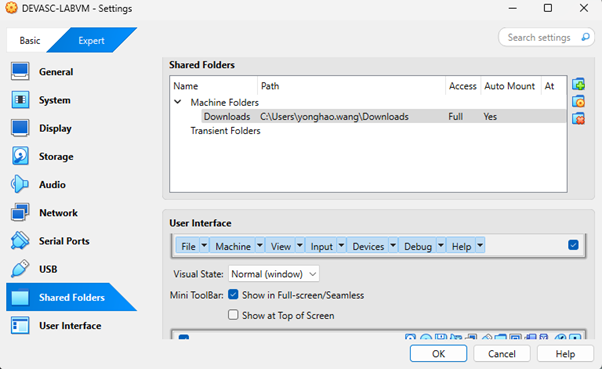

# Guide: Adding New Files to a Disk Image for Digital Forensics Study

## 1. Preparation
- Set up a Linux virtual machine (VM). For example:
  - **OS:** Ubuntu 20.04.6 LTS
  - **Codename:** focal
  - **Username:** `devasc`
  - **Password:** `Cisco123!`

- Ensure VirtualBox Guest Additions are installed and updated:
  ```bash
  sudo apt update
  sudo apt install virtualbox-guest-utils virtualbox-guest-x11 virtualbox-guest-dkms -y
  ```

## 2. Mount Shared Folder
- On the **Windows host**:
  - Create a shared folder named `Downloads`.
  - Enable **Auto-mount** and **Make Permanent**.

  

- On the **Linux guest**:
  ```bash
  mkdir ~/windown
  sudo mount -t vboxsf Downloads /home/devasc/windown/
  ```
- Verify that the guest can access the host folder.

### Note on Auto-Mount Behavior
When VirtualBox auto-mounts shared folders, they often appear under:
```
/media/sf_<SharedFolderName>
```
Example: `/media/sf_Downloads`

To make this consistent:
- Create a symbolic link:
  ```bash
  ln -s /media/sf_Downloads ~/windown
  ```
- Or disable auto-mount in VirtualBox and manually mount using:
  ```bash
  sudo mount -t vboxsf Downloads /home/devasc/windown/
  ```

## 3. Analyze the Current Disk Image
- Navigate to your forensic image directory:
  ```bash
  cd ~/forensic_image_lab
  ```
- Install SleuthKit if not already installed:
  ```bash
  sudo apt install sleuthkit
  ```
- Use `mmls` to view partition layout:
  ```bash
  mmls diskimageMT.001
  ```
Example output:
```
Slot    Start     End       Length     Description
001:    0         62        63         Unallocated
002:    63        224909    224847     NTFS / exFAT (0x07)
003:    224910    240974    16065      FAT12 (0x01)
004:    240975    250878    9904       Unallocated
```

## 4. Mount the NTFS Partition
- Create a mount point:
  ```bash
  mkdir mnt_ntfs
  ```
- Calculate the offset:
  `Start sector × 512 bytes = 63 × 512 = 32256`
- Mount the partition:
  ```bash
  sudo mount -o loop,offset=32256 diskimageMT.001 mnt_ntfs
  ```
- List files:
  ```bash
  ls mnt_ntfs/
  ```

## 5. Add New Files
- Copy the desired files into `mnt_ntfs/` using `cp` or file manager.

## 6. Unmount and Save
- Sync and unmount:
  ```bash
  sync
  sudo umount mnt_ntfs
  ```
- The disk image now includes the new files.

---
